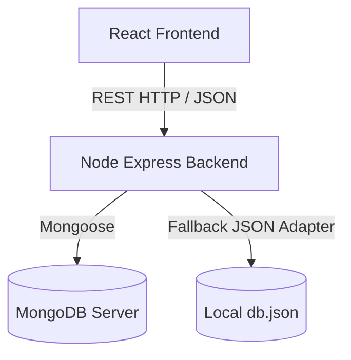

# YatraSetu System Architecture

This document describes the high-level design of the **YatraSetu** platform, including component boundaries, data flows, and client-server interactions.

---

## 1. High-Level Design

The application is structured as a client-server web app using the MERN stack with a dual-mode database layer:

### Component Breakdown
1. **Client Tier (React & Vite)**:
   - **Views**: Setup wizards, interactive Leaflet maps, and Recharts dashboards.
   - **Service Layer**: Communicates with the backend using a centralized API adapter.
2. **Server Tier (Node.js & Express)**:
   - **Routers**: Handles authentication, itinerary optimization, marketplace queries, and AI chatbot inputs.
   - **Services**: Optimizes trip budgets and calculates vendor trust scores.
3. **Database Tier**:
   - Uses Mongoose to connect to a local or remote MongoDB instance.
   - Automatically falls back to reading/writing `db.json` if MongoDB is offline.
